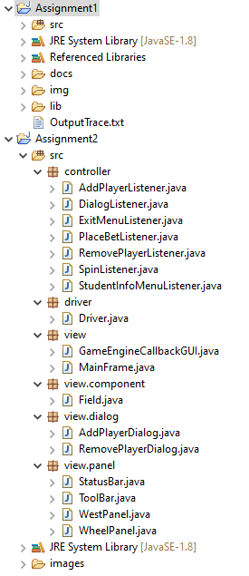
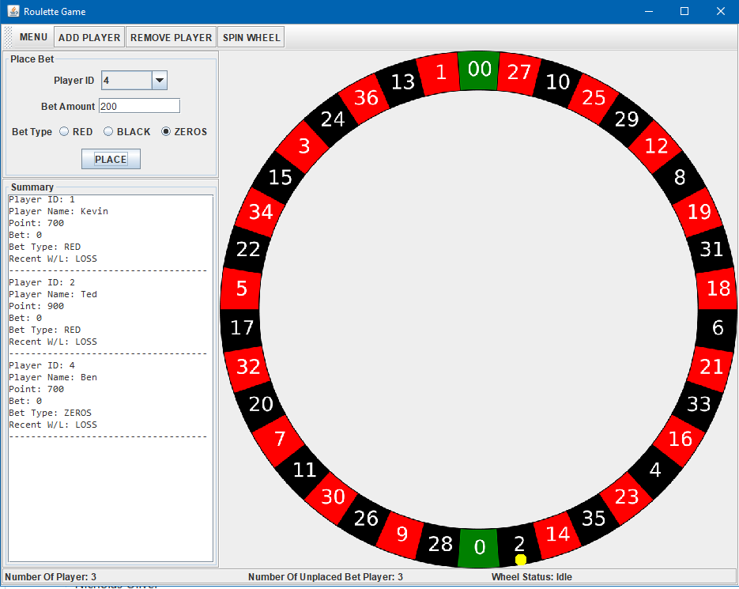
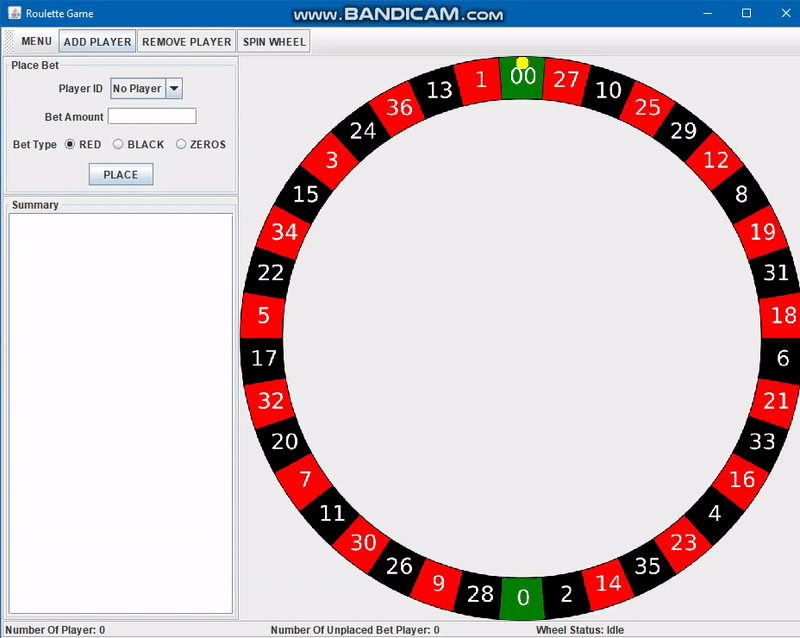

# WheelGame
RMIT-FP Semester 1 2019 

© Kevin Vu 2019. Disclaimer: This repo is an asset of Kevin Vu and is being developed as part of a School of Science Further Programming course at RMIT University in Melbourne, Australia. Any plagiarism act will be reported.

## Personal Assignment
- Dr. Caspar Ryan (Instructor)
- Kevin Vu

## Project Brief
- Build an AWT/Swing graphical user interface for the Wheel Game 

## Functionalities
### Project Structure

### Short Demo

